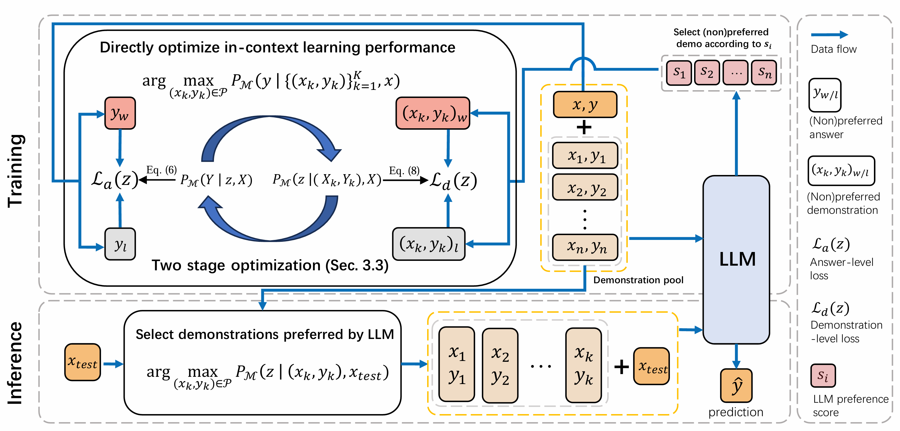

# GenICL

This repository contains the code for our paper [Learning to Select In-Context Demonstration Preferred by Large Language Model](https://aclanthology.org/2025.findings-acl.592.pdf).

In-context learning (ICL) enables large language models (LLMs) to adapt to new tasks during inference using only a few demonstrations. However, ICL performance is highly dependent on the selection of these demonstrations. Recent work explores retrieval-based methods for selecting query-specific demonstrations, but these approaches often rely on surrogate objectives such as metric learning, failing to directly optimize ICL performance. Consequently, they struggle to identify truly beneficial demonstrations. Moreover, their discriminative retrieval paradigm is ineffective when the candidate pool lacks sufficient high-quality demonstrations. To address these challenges, we propose GenICL, a novel generative preference learning framework that leverages LLM feedback to directly optimize demonstration selection for ICL. Experiments on 19 datasets across 11 task categories demonstrate that GenICL achieves superior performance than existing methods in selecting the most effective demonstrations, leading to better ICL performance.



## Prerequisites

### Install Dependencies

```shell
pip install -r requirements.txt
```


### Download Data

```shell
bash scripts/dataset_process/download_data.sh
```

If you want to run experiments on only a subset of tasks, you need to manually select the tasks (filter the dataset).


## Generate LLM Preference Data.

```shell
bash scripts/dataset_process/search_topk.sh
```

```shell
bash scripts/dataset_process/gen_llm_score.sh
```

## Training
```shell
bash scripts/classification_tasks/train_kto_lora.sh
```


## Evaluation

```shell
bash scripts/classification_tasks/test_kto_lora_.sh
```


## Citation
```bibtex
@inproceedings{zhang-etal-2025-learning-select,
    title = "Learning to Select In-Context Demonstration Preferred by Large Language Model",
    author = "Zhang, Zheng  and
      Lan, Shaocheng  and
      Song, Lei  and
      Bian, Jiang  and
      Li, Yexin  and
      Ren, Kan",
    booktitle = "Findings of the Association for Computational Linguistics: ACL 2025",
    year = "2025"
}
```
# GenICL_preferred
